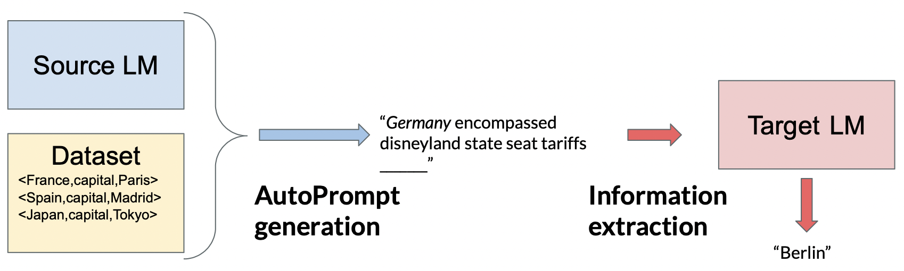

# Prompt generalization
This repository gathers the data and code for the paper [Can discrete information extraction prompts generalize across language models?](https://arxiv.org/abs/2302.09865)

We share all the generated prompts in this repository. Please refer to the corresponding fork if you want to evaluate the prompts on the language models or generate your own.
- Evaluation:  [LAMA](https://github.com/ncarraz/LAMA)
- Single-model training: [AutoPrompt](https://github.com/ncarraz/autoprompt)
- Mixed-training: [Mixed-training AutoPrompt](https://github.com/ncarraz/autoprompt/tree/mix-match)

